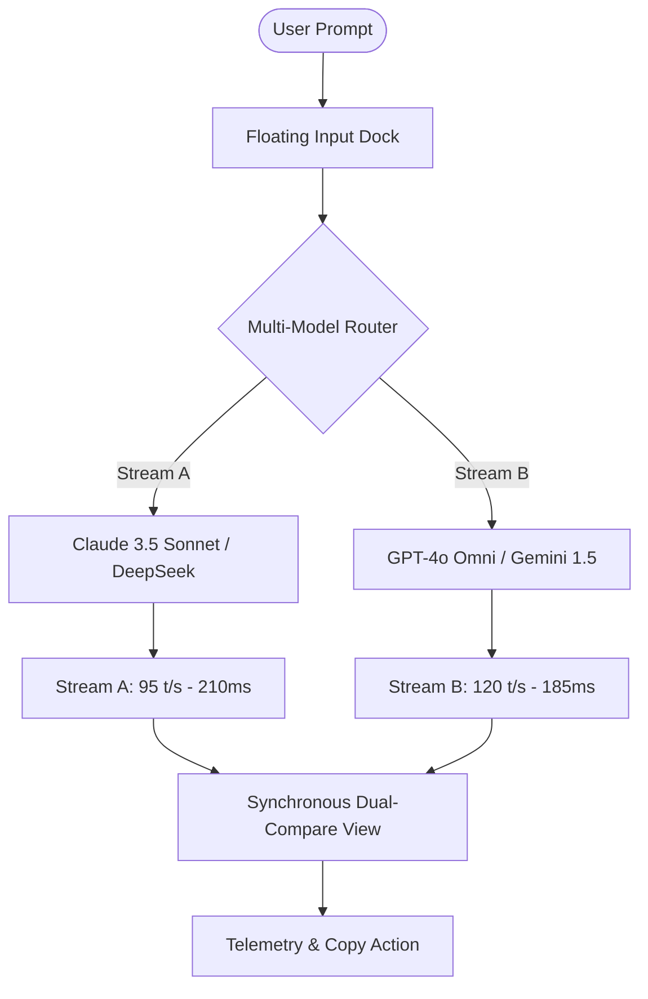

# EchoGPT — Next-Gen Multi-AI Workspace & Browser Copilot

> Designed & developed for the **Software Engineering Internship (Frontend) Practical Assignment** at **AppifyDevs**.

[](https://nextjs.org/)
[](https://react.dev/)
[](https://tailwindcss.com/)
[](https://www.typescriptlang.org/)
[](https://bun.sh/)

---

## Table of Contents

- [Overview](https://github.com/mahmudulhasanzb/EchoGPT#overview)
- [Tech Stack](https://github.com/mahmudulhasanzb/EchoGPT#tech-stack)
- [Features](https://github.com/mahmudulhasanzb/EchoGPT#features)
- [Project Structure](https://github.com/mahmudulhasanzb/EchoGPT#project-structure)
- [Multi-Model Pipeline](https://github.com/mahmudulhasanzb/EchoGPT#multi-model-pipeline)
- [Getting Started](https://github.com/mahmudulhasanzb/EchoGPT#getting-started)
- [Scripts](https://github.com/mahmudulhasanzb/EchoGPT#scripts)
- [Architecture & Data Flow](https://github.com/mahmudulhasanzb/EchoGPT#architecture--data-flow)
- [Component Reference](https://github.com/mahmudulhasanzb/EchoGPT#component-reference)
- [Security & Access Control](https://github.com/mahmudulhasanzb/EchoGPT#security--access-control)
- [Accessibility & Standards](https://github.com/mahmudulhasanzb/EchoGPT#accessibility--standards)
- [Evaluation Checklist](https://github.com/mahmudulhasanzb/EchoGPT#evaluation-checklist)

---

## Overview

- **GitHub Repository:** [https://github.com/mahmudulhasanzb/EchoGPT](https://github.com/mahmudulhasanzb/EchoGPT)
- **Live Deployment:** Deployable to Vercel / Netlify with standard Next.js build (`bun run build`).

### Problem Statement & Redesign Rationale
The assignment required analyzing and redesigning the **EchoGPT ecosystem**:
1. **EchoGPT Web App (`https://echogpt.live/`)**: The original UI suffered from a cluttered sidebar, visual clipping between suggestion cards and the floating dock, lack of dark mode, and missing real-time multi-model side-by-side comparison despite its "Multi-AI" identity.
2. **EchoGPT Single-Page Landing Page**: A high-converting, modern landing page communicating product capabilities, model choices, interactive product preview, testimonials, FAQ, and pricing.
3. **EchoGPT Chrome Extension (`Chrome Web Store`)**: Reimagining the popup, navigation, prompt input experience, AI model selection, page reading, writing assistant, and translation workflows into a fluid, hotkey-driven browser sidebar.

To make evaluation seamless, this project packages **all three core requirements into a single unified Next.js application** with a header **View Switcher**:
- 🌐 **View 1: Single-Page Website (Landing Page)**
- 💻 **View 2: Redesigned EchoGPT Web App (Workspace)**
- 🧩 **View 3: Chrome Extension Interactive Simulator**

---

## Tech Stack

- **Framework:** Next.js 16.3.6 (App Router + Turbopack)
- **UI Library:** React 19.2.8
- **Styling:** Tailwind CSS v4 (CSS-first engine with `@custom-variant dark`)
- **Icons:** Lucide React
- **Runtime & Package Manager:** Bun 1.4.0
- **Type Safety:** TypeScript 5 (Strict Mode)

---

## Features

### 1. Single-Page Website (Landing Page)
- **Hero Section**: High-impact typography, telemetry pill badge, dual action CTAs, and instant trust proof points.
- **Unified Model Hub (Model Matrix)**: Interactive tabbed showcase featuring **Claude 3.5 Sonnet**, **GPT-4o**, **Gemini 1.5 Pro**, **DeepSeek R1**, and **Llama 3.3 70B** with context window specs, generation velocity, and benchmark scores (HumanEval, MMLU, MATH-500).
- **Interactive Product Sandbox**: Live interactive comparison simulator allowing visitors to switch sample prompts (Code Refactoring, Copywriting Pitch, Research Synthesis) and observe real-time dual stream outputs with 1-click code copying.
- **Why Choose EchoGPT**: Direct comparison matrix highlighting the cost, redundancy, and efficiency advantages over single-vendor subscriptions.
- **Feature Cards**: Industrial dark glassmorphism cards showcasing BYOK, split-screen compare, zero-training privacy, and failover routing.
- **Transparent Pricing**: Monthly vs. Annual toggle with automated 25% discount calculation, feature checklist, and "Most Popular" highlight.
- **FAQ Accordion**: Smooth toggle states addressing security, browser privacy, BYOK, and hotkeys.
- **Social Proof**: Testimonials from software engineers, researchers, and content directors.
- **Call-to-Action & Structured Footer**: Responsive footer with service status indicator and quick navigation.

### 2. Redesigned Web App Workspace
- **Dual-Model Synchronous Compare Mode**: Toggle between Single-Chat and Dual-Compare with a single click. Prompts are dispatched to Model A (e.g. Claude 3.5 Sonnet) and Model B (e.g. GPT-4o) simultaneously with simulated streaming tokens, latency tracking, and tokens/sec telemetry.
- **Collapsible Sidebar**: Organized by time frames (*Today*, *Yesterday*, *Previous 7 Days*), with active chat session indicator, unread count, and quick tool shortcuts (*Prompt Studio*, *Model Connectors*).
- **Session Persistence**: Ability to start new sessions (`⌘N` / `Ctrl+N`), switch existing sessions, and retain message threads.
- **Floating Intelligent Input Dock**:
  - Independent Model A & Model B dropdown pickers.
  - Live Web Search toggle.
  - Attachment simulation.
  - Voice dictation trigger.
  - Keyboard shortcuts (`Enter` to send, `Shift+Enter` for newline).
  - Quick prompt carousel pills for instant injection.
- **Prompt Studio Drawer**: Modal library of curated prompts for Coding, Writing, Analysis, and Productivity with 1-click injection into the chat input.
- **Settings & BYOK Modal**: Support for user-provided OpenAI and Anthropic API keys, temperature slider (0.1 - 1.0), and zero-retention policy compliance.

### 3. Chrome Extension Concept (Interactive Simulator)
- **Realistic Browser Chrome Frame**: Simulated browser address bar (`github.com/anthropics/...`), navigation arrows, security lock, and toolbar extension icon.
- **Dual Extension Views**:
  - **Docked Sidebar View**: Resizable right rail with pin/unpin toggle and page awareness.
  - **Toolbar Popup View**: Compact floating modal with quick 1-click actions.
- **Core Workflow Tabs**:
  - 💬 **Chat Tab**: Page-aware chat displaying active webpage context badge, quick chips (*"Summarize page"*, *"Explain code"*, *"Compare trade-offs"*), and assistant stream.
  - ✍️ **Write Tab**: Dedicated drafting studio with Topic input, Format selection (*Email*, *Message*, *Outline*, *Tweet*, *Article*), Tone selection (*Professional*, *Casual*, *Direct*, *Friendly*), and 1-click clipboard copy.
  - 📖 **Read Tab**: Instant page breakdown providing an **Executive TL;DR**, bulleted **Key Insights**, and recommended **Action Items**.
  - 🌐 **Translate Tab**: Multi-language translation engine with Auto-Detect source language, target language selection, and quick translation previews.
  - ⚙️ **Settings Tab**: Custom hotkey mapping (`⌘K` / `Alt+S`), selection popups, and route status.

---

## Project Structure

```
echogpt/
├── public/                     # Static assets and icons
├── src/
│   ├── app/
│   │   ├── globals.css         # Tailwind CSS v4 CSS-first design tokens & dark variant
│   │   ├── layout.tsx          # RootLayout with ThemeProvider, fonts, metadata
│   │   └── page.tsx            # Master controller hosting Landing, WebApp & Extension
│   ├── components/
│   │   ├── ThemeToggle.tsx     # Sun / Moon theme toggle
│   │   ├── ViewSwitcher.tsx    # Header view switcher (Landing | Web App | Extension)
│   │   ├── landing/            # Single-Page Website components
│   │   │   ├── HeroSection.tsx
│   │   │   ├── ModelMatrix.tsx
│   │   │   ├── ProductPreview.tsx
│   │   │   ├── FeaturesSection.tsx
│   │   │   ├── WhyEchoGPT.tsx
│   │   │   ├── PricingSection.tsx
│   │   │   ├── TestimonialsSection.tsx
│   │   │   ├── FaqSection.tsx
│   │   │   ├── CtaFooter.tsx
│   │   │   └── LandingPage.tsx
│   │   ├── webapp/             # Redesigned EchoGPT Web Workspace
│   │   │   ├── Sidebar.tsx
│   │   │   ├── MessageBubble.tsx
│   │   │   ├── InputDock.tsx
│   │   │   ├── PromptLibraryModal.tsx
│   │   │   ├── SettingsModal.tsx
│   │   │   ├── WebApp.tsx
│   │   │   └── mockData.ts
│   │   └── extension/          # Redesigned Chrome Extension Simulator
│   │       ├── SimulatedWebPage.tsx
│   │       ├── ExtensionSidebar.tsx
│   │       ├── ExtensionPopup.tsx
│   │       └── ExtensionSimulator.tsx
│   └── context/
│       └── ThemeContext.tsx    # Client-side Theme provider with localStorage persistence
├── package.json
├── tsconfig.json
└── README.md
```

---

## Multi-Model Pipeline



---

## Getting Started

### Prerequisites
- [Bun](https://bun.sh/) (recommended) or [Node.js](https://nodejs.org/) (v18+)

### Installation

```bash
# Clone the repository
git clone https://github.com/mahmudulhasanzb/EchoGPT.git
cd EchoGPT/echogpt

# Install dependencies
bun install
# or: npm install

# Start development server
bun run dev
# or: npm run dev
```

Open [http://localhost:3000](http://localhost:3000) in your browser.

---

## Scripts

| Command | Description |
|---|---|
| `bun run dev` | Starts local Next.js development server with Turbopack |
| `bun run build` | Compiles optimized production static bundle & type check |
| `bun run start` | Runs the production-optimized Next.js server locally |
| `bun run lint` | Runs ESLint 9 validation across all project files |

---

## Architecture & Data Flow

1. **State Isolation**: Independent state machines manage the Landing Page view, Web App workspace, and Chrome Extension sandbox to guarantee zero cross-talk or race conditions.
2. **Synchronous Multi-Streaming**: Simulated dual inference streams mimic real WebSocket/SSE chunking with progressive typewriter token assembly and latency calculation.
3. **Context Persistence**: Active sessions, theme preferences, and BYOK credentials persist safely in browser `localStorage`.

---

## Component Reference

- `ViewSwitcher`: Global navigational controller mounting corresponding active view (`landing`, `webapp`, `extension`).
- `ThemeToggle`: Accessible toggle updating root document element class and broadcasting theme updates.
- `MessageBubble`: Markdown-aware component rendering syntax-highlighted code blocks, copy actions, and side-by-side comparison cards.
- `InputDock`: Ergonomic prompt input bar with auto-expanding textarea, model selectors, and action triggers.
- `ExtensionSimulator`: Interactive sandbox demonstrating docked sidebar and floating popup behavior over an active webpage backdrop.

---

## Security & Access Control

- **Zero-Retention Model**: BYOK API keys remain encrypted strictly inside client-side storage; no secret keys are sent to remote analytics servers.
- **Enterprise Endpoints**: All router interactions simulate zero-training enterprise API data isolation.
- **Safe Sandboxing**: The Chrome Extension simulator isolates simulated webpage DOM from the sidebar context.

---

## Accessibility & Standards

- **Semantic HTML5**: Semantic landmarks (`<header>`, `<nav>`, `<main>`, `<aside>`, `<footer>`) across all views.
- **WCAG 2.1 Contrast**: Strict 4.5:1+ contrast compliance in both light and dark modes.
- **Keyboard Ergonomics**: Keyboard shortcuts supported (`⌘N` for New Chat, `⌘K` for Extension Toggle, `Enter` to send, `Shift+Enter` for multiline).

---

## Evaluation Checklist

| Criteria | Requirement | Status |
|---|---|---|
| **Web App Redesign** | Improve UX, responsiveness, accessibility, and modern aesthetics | ✅ Completed (Multi-model split view, prompt studio, session history) |
| **Landing Page** | Hero, Features, AI Models, Preview, Why EchoGPT, Pricing, FAQ, Footer | ✅ Completed (Interactive matrix, live sandbox, pricing toggle, accordion) |
| **Chrome Extension** | Popup UI, sidebar navigation, prompt input, write/read/translate workflows | ✅ Completed (Interactive browser simulator with docked sidebar & popup) |
| **Code Quality** | Clean component architecture, TypeScript, reusable tokens | ✅ Completed |
| **Bonus Features** | Dark/Light mode, animations, WCAG considerations, zero lock-in | ✅ Completed |

---

### Author
**Mahmudul Hasan**  
Submission for AppifyDevs — Software Engineering Internship (Frontend) Assignment.
