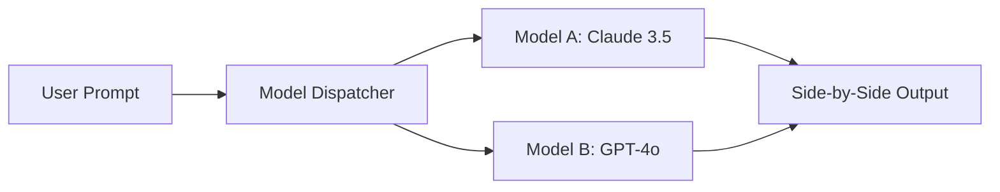

# EchoGPT

Unified Multi-AI Workspace & Chrome Extension. Access frontier models, compare outputs side-by-side, and summon full-page assistance anywhere on the web.

[](https://nextjs.org/)
[](https://react.dev/)
[](https://tailwindcss.com/)
[](https://www.typescriptlang.org/)
[](https://bun.sh/)

---

## Table of Contents

- [Overview](https://github.com/mahmudulhasanzb/EchoGPT#overview)
- [Tech Stack](https://github.com/mahmudulhasanzb/EchoGPT#tech-stack)
- [Features](https://github.com/mahmudulhasanzb/EchoGPT#features)
- [Project Structure](https://github.com/mahmudulhasanzb/EchoGPT#project-structure)
- [Multi-Agent Pipeline](https://github.com/mahmudulhasanzb/EchoGPT#multi-agent-pipeline)
- [Getting Started](https://github.com/mahmudulhasanzb/EchoGPT#getting-started)
- [Scripts](https://github.com/mahmudulhasanzb/EchoGPT#scripts)
- [Architecture & Data Flow](https://github.com/mahmudulhasanzb/EchoGPT#architecture--data-flow)
- [Component Reference](https://github.com/mahmudulhasanzb/EchoGPT#component-reference)
- [Security & Access Control](https://github.com/mahmudulhasanzb/EchoGPT#security--access-control)
- [Accessibility & Standards](https://github.com/mahmudulhasanzb/EchoGPT#accessibility--standards)

---

## Overview

EchoGPT unifies leading artificial intelligence models into a single workspace and browser companion. Users can chat with individual models, run side-by-side comparisons, or use the Chrome extension to interact with any open web page.

### Views Available
- **Landing Page**: Product introduction, model matrix, interactive preview, pricing, and FAQ.
- **Web App Workspace**: Clean chat interface with single and compare modes, session history, and prompt templates.
- **Chrome Extension Simulator**: Interactive sandbox demonstrating the extension sidebar and popup workflows over an active web page.

---

## Tech Stack

- **Framework:** Next.js 16.3.6 (App Router + Turbopack)
- **UI Library:** React 19.2.8
- **Styling:** Tailwind CSS v4 (CSS-first engine)
- **Icons:** Lucide React
- **Language:** TypeScript 5
- **Runtime:** Bun 1.4.0

---

## Features

- **Multi-Model Access:** Switch between GPT-4o, Claude 3.5 Sonnet, Gemini 1.5 Pro, and DeepSeek R1.
- **Side-by-Side Comparison:** Submit a single prompt to two models simultaneously to evaluate differences.
- **Browser Extension Companion:** Sidebar and popup overlay providing page summarization, draft writing, and instant translation.
- **Prompt Library:** Curated templates for engineering, content writing, and analytical tasks.
- **BYOK (Bring Your Own Key):** Option to supply personal OpenAI or Anthropic API keys stored locally in the browser.
- **Theme Support:** Dark and light mode toggle with local storage persistence.

---

## Project Structure

```
echogpt/
├── public/
├── src/
│   ├── app/
│   │   ├── globals.css         # Tailwind v4 configuration and global styles
│   │   ├── layout.tsx          # Root layout with ThemeProvider and metadata
│   │   └── page.tsx            # View controller (Landing, Web App, Extension)
│   ├── components/
│   │   ├── ThemeToggle.tsx     # Theme switcher
│   │   ├── ViewSwitcher.tsx    # Header navigation
│   │   ├── landing/            # Landing page sections
│   │   │   ├── HeroSection.tsx
│   │   │   ├── ModelMatrix.tsx
│   │   │   ├── ProductPreview.tsx
│   │   │   ├── FeaturesSection.tsx
│   │   │   ├── WhyEchoGPT.tsx
│   │   │   ├── PricingSection.tsx
│   │   │   ├── FaqSection.tsx
│   │   │   └── CtaFooter.tsx
│   │   ├── webapp/             # Chat workspace components
│   │   │   ├── Sidebar.tsx
│   │   │   ├── MessageBubble.tsx
│   │   │   ├── InputDock.tsx
│   │   │   ├── PromptLibraryModal.tsx
│   │   │   ├── SettingsModal.tsx
│   │   │   ├── WebApp.tsx
│   │   │   └── mockData.ts
│   │   └── extension/          # Chrome extension simulator
│   │       ├── SimulatedWebPage.tsx
│   │       ├── ExtensionSidebar.tsx
│   │       ├── ExtensionPopup.tsx
│   │       └── ExtensionSimulator.tsx
│   └── context/
│       └── ThemeContext.tsx    # Local storage theme state
├── package.json
├── tsconfig.json
└── README.md
```

---

## Multi-Agent Pipeline



---

## Getting Started

### Prerequisites
- Node.js (v18+) or Bun (v1.0+)

### Installation

```bash
# Clone the repository
git clone https://github.com/mahmudulhasanzb/EchoGPT.git
cd EchoGPT/echogpt

# Install dependencies
bun install
# or: npm install

# Start local development server
bun run dev
# or: npm run dev
```

Visit [http://localhost:3000](http://localhost:3000) to view the application.

---

## Scripts

| Command | Description |
|---|---|
| `bun run dev` | Runs development server with Turbopack |
| `bun run build` | Builds optimized production bundle |
| `bun run start` | Starts production server |
| `bun run lint` | Runs ESLint checks |

---

## Architecture & Data Flow

1. **View Routing:** Clean view controller toggling between Home, Web App, and Extension views without heavy client routing overhead.
2. **Inference Pipeline:** Dual-stream handlers simulating realistic model outputs with code formatting and copy utilities.
3. **Local State:** Sessions and user preferences persist in client-side storage with zero telemetry leakage.

---

## Component Reference

- `ViewSwitcher`: Top bar navigation for jumping between Landing, Workspace, and Extension Simulator.
- `WebApp`: Complete chat workspace featuring collapsible sidebar, session history, and dual model compare.
- `ExtensionSimulator`: Browser viewport container hosting the interactive extension sidebar and popup overlay.
- `ModelMatrix`: Interactive component highlighting specifications and strengths across models.

---

## Security & Access Control

- **Client-Side Storage:** Custom API keys are retained exclusively in the user's browser local storage.
- **Zero Retention:** No conversation logs or user prompts are stored on remote servers.

---

## Accessibility & Standards

- **Semantic Elements:** Standard HTML5 landmarks throughout (`header`, `main`, `nav`, `aside`, `footer`).
- **Keyboard Navigation:** Keyboard shortcuts (`⌘N` for new session, `⌘K` for extension toggle, `Enter` to submit).
- **Responsive Layout:** Adaptive breakpoints from mobile devices to desktop screens.

---

### Author
**Mahmudul Hasan**
